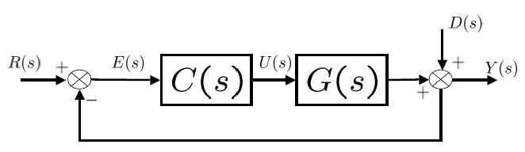
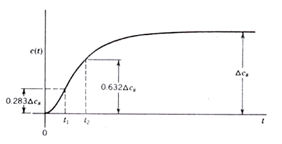
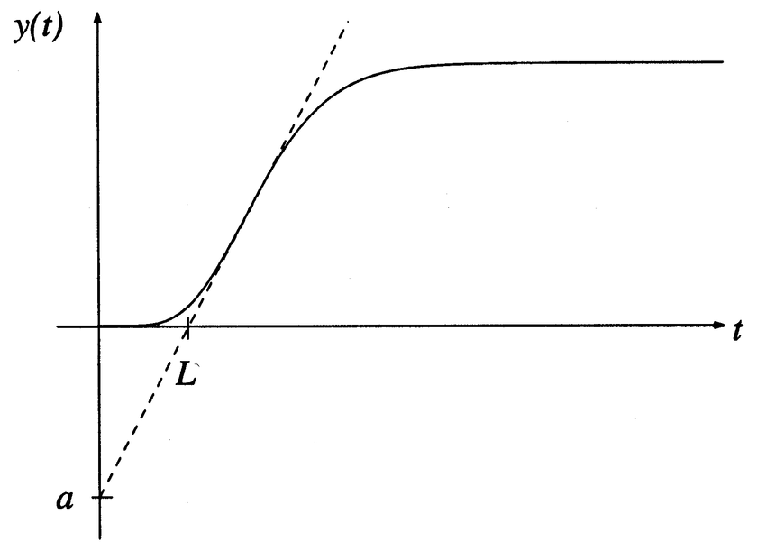
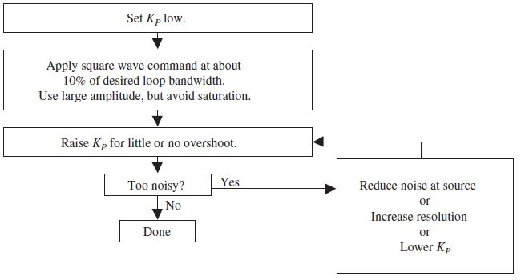
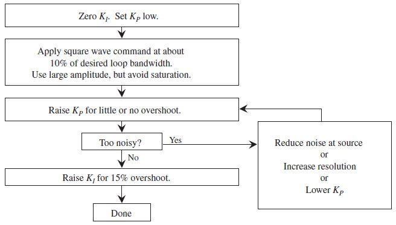
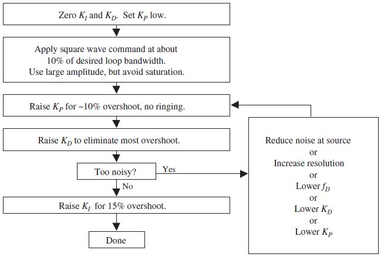

# Overzicht
In het afstellen van regelaars is het kennen van het verschil tussen setpoint-respons en verstoring-respons zeer belangrijk. Afhankelijk van de eisen zal het afstellen specifiek gebeuren om betrouwbaar van setpoint te veranderen of om het proces bestand te maken tegen externe krachten. Om verschillende afstelregels met elkaar te kunnen vergelijken is er een maat voor nauwkeurigheid nodig. De gekwadrateerde error waarde ($R^2$), de integraal van de absolute error waarde ($IAE$) of de integraal van de gekwadrateerde error waarde zijn methodes om een idee te geven van de prestaties.   
* todo: python simulatie om verschil tussen setpoint-respons en verstoring-respons duidelijk te maken
  
<!--
 De Z-N methode niet bespreken. Er bestaan tegenwoordig meer robuuste technieken.
-->

# Direct synthese (DS)
 

Directe synthese start vanuit de transferfunctie van de gesloten lus. Door de controller (C(s)) af te zonderen kan men de gewenste reactie $\frac{Y(s)}{R(s)}$ definiëren en combineren met het procesmodel. Bij perfecte controle is de gewenste reactie gelijk aan $\underline{één}$ maar dit is niet mogelijk omdat hiervoor een oneindige versterking nodig is. Daarom vervangen we dit door een eerste of twee orde met dode tijd waarvan de prestaties geaccepteerd worden.  

Een eerste orde model met dode tijd:

$$ G^* (s) = \frac{Ke^{-\theta s}}{\tau_1 s +1} $$
De structuur van een PI controller is als volgt weergegeven:

$$ G(s) = K_c (1+ \frac{1}{\tau_I s}) $$
Hieruit kunnen de volgende instelregels bepaald worden:
$$[ 
K_c = \frac{1}{K} \frac{\tau_1}{\theta + \tau_c},
\tau_I = \tau_1 
$$

Een tweede orde model ziet er als volgt uit:
$$ G^* (s) = \frac{Ke^{-\theta s}}{(\tau_1 s +1)(\tau_2 s +1)}$$
Hiervoor gebruiken we een PID controller:
$$ G(s) = K_c (1 + \frac{1}{\tau_I s} + \tau_D s) $$
Hieruit worden de volgende instelregels gebruikt:
$$ 
K_c = \frac{1}{K} \frac{\tau_1 + \tau_2}{\theta + \tau_c}, 
\tau_I = \tau_1 + \tau_2,
\tau_D = \frac{\tau_1 \tau_2}{\tau_1 + \tau_2}  
$$

Een voorbeeld:
Stel dat het volgende model het proces representeert. 
$$ G^* (s) =  \frac{1.2e^{-0.5 s}}{(8 s +1)(2 s +1)} $$
Hieruit valt $K = 1.2$, $\theta = 0.5$, $\tau_1 = 8$ en $\tau_2 = 2$ af te leiden. Door de instelregels van directe synthese te volgen zijn $K_c$ (afhankelijk van $\tau_c$), $\tau_I = 10$ en $\tau_D = \frac{8}{5}$ gekend. De simulaties moeten duidelijk maken welke gesloten lus tijdsconstante de beste controller versterking weergeeft. 

* todo: simulatiescreenshots invoegen voor verschillende $\tau_c$

De keuze van $\tau_c$ is essentieel maar hierover bestaat veel onduidelijkheid. Verschillende richtlijnen proberen dit op te klaren. 

1. $\frac{\tau_c}{\theta} > 0.8$ en $\tau_c$ > $0.1\tau$ (Rivera et al., 1986)
2. $\tau > \tau_c > \theta$ (Chien and Fruehauf, 1990)
3. $\tau_c = \theta$ (Skogestad, 2003)

# Internal Model Control (IMC)

Enkel eerste en tweede orde modellen vallen onder de uiteenzetting van de (S)IMC regels. Hogere orde systemen vergt meer rekenkracht waarbij een computer en de nodige software nodig zijn. Deze procedure werkt in twee stappen.

1. Bemachtig het eerste (of tweede) orde model met dode tijd. 
	$$ G(s) = \frac{k}{\tau_1 s + 1} \exp^{-\theta s}	$$
	$$ G(s) = \frac{k}{(\tau_1 s + 1)(\tau_2 s + 1)} \exp^{-\theta s}	$$
1.  Leid de controller parameters af met de model gebaseerde (S)IMC regels.

 

### Voorbeeld

Kies een tweede orde met dode tijd wanneer $\tau_2$ groter is dan de proces vertraging. De volgende regels zijn algemeen erkend om de parameters te berekenen.

$$ k'= \frac{k}{\tau_1} $$
$$ K_c = \frac{1}{k'} \frac{1}{\tau_c + \theta}	$$
$$ \tau_I = min{\tau_1, 4(\tau_c + \theta)} $$
De afgeleide term $\tau_D$ is pas noodzakelijk wanneer $\tau_2$ groter is dan $\theta$. $\tau_D$ krijgt dan dezelfde waarde als $\tau_2$.

Door de gesloten lus tijdsconstante ($\tau_c$) gelijk te stellen met $\tau$ blijft de reactie relatief snel. Samen met een behouden robuustheid. Voor een verhoging van de reactie kan men $\tau_c$ verlagen. Bij het verhogen van $\tau_c$ verlaagt men het reactief vermogen. 

$$ K_c \frac{d_u}{e_{max}} $$
$d_u$ staat voor de externe storingen die invloed hebben op het ingangssignaal. $e_{max}$ staat voor de de maximale afwijking op het uitgangssignaal die getolereerd wordt door de ontwerper.
Bij verschillende modellen zijn aangepaste regels noodzakelijk.

# Respons methoden
<!--
zie hoofdstuk 6 Advanced PID control
-->

Door het proces te testen op zijn open lus reactie is het mogelijk om een beeld te vormen van van de proceseigenschappen. Veelgebruikte ingangssignalen zijn: een stap, een impuls en een sinusoïde. 

 
[[2]](#2)

 
[[2]](#2)
	

Als een respons na $8 \theta$ niet stabiliseert naar een bepaalde waarde, stop dan het experiment.

$\theta$: dode tijd

$\tau_1$: tijdconstante

De tijdconstante is de tijd die je bij de dode tijd moet voegen om 63\% van de finale waarde te bekomen.\

k: steady-state toename\

k': de toename na de dode tijd

$$ k = \frac{\Delta y(1)}{\Delta u} $$
$$ k' = \frac{k}{\tau_1} $$

\begin{table}[h]
	\centering
	\begin{tabular}{ c|c|c|c|c }
		Controller & $\alpha_K$ & $T_i/L$ & $T_d/L$ & $T_p/L$\\
		\hline
		P & 1 & ... & ... & 4\\
		PI & 0.9 & 3 & ... & 5.7\\
		PID & 1.2 & 2 & L/2 & 3.4
	\end{tabular}
	\caption{Afstelregel voor eerste orde processen.}
\end{table}

Deze waarden zijn gebaseerd op een open-lus stap respons van een simpel proces. Zoals in illustratie \ref{fig:stap_eersteorde} te zien is, is de stap respons met twee parameters ($\alpha$ en $L$) gekenmerkt. 

### Voorbeeld

Als $\alpha = 0.218$ en $L = 0.806$ blijken te zijn dan vallen de volgende parameters uit de tabel af te leiden. $K = 5.5$, $T_i = 1.61$ en $T_d = 0.403$. 

<!-- 
## Frequentie respons methode 
Deze methode maakt gebruik van de Nyquist curve, meer bepaald van het kritische punt gekarakteriseerd door de parameters $K_u$ en $T_u$.\\

\[ K_u = \frac{1}{K_{180}} \] 
\[ T_u = \frac{2\pi}{\omega_{180}} \]
\[ T_u = \frac{2\pi}{\omega_{u}} \]

In het hoofdstuk 'Systeemtheorie' zal de techniek van Nyquist verder verduidelijkt worden.
\\
Verbind een controller aan het proces en zet de parameters zodat enkel de proportionele parameter dominant is. ($T_i = \infty$ en $T_d = 0$)
Verhoog traag de proportionele parameter tot het systeem oscillerend gedrag begint te vertonen. Deze waarde staat gelijk aan $K_u$. De periode van de oscillatie is $T_u$. 
\\
De volgende verhoudingen kunnen functioneren als startwaardes in het afstellen van de regelaar. 

\begin{center}
	\begin{tabular}{c| c c c c}
		Controller & $K/K_u$ & $T_i/T_u$ & $T_d/T_u$ & $T_p/T_u$ \\
		\hline
		P & 0.5 & ... & ... & 1.0 \\
		PI & 0.4 & 0.8 & ... & 1.4 \\
		PID & 0.6 & 0.5 & 0.125 & 0.85
	\end{tabular}
\end{center}
-->

## CHR Methode
Chien, Hrones en Reswich creëerde deze methode welke een aanpassing is van de open lus Ziegler-Nichols. 
<!--
	\begin{center}
	\begin{tabular}{c|c|c|c c}
	... & No overshoot & 20$\%$ overshoot & ... & ... \\
	\hline
	Controller & ... & ... & ... & ...\\
	P & 0.5 & ... & ... & 1.0 \\
	PI & 0.4 & 0.8 & ... & 1.4 \\
	PID & 0.6 & 0.5 & 0.125 & 0.85
	\end{tabular}
	\end{center}
-->

We onderscheiden afstelregels voor meer robuustheid of betere setpoint-tracking. 
Op de aangegeven punten leest men $t_1$ en $t_2$ af waaruit we met de volgende formules $\tau_m$ en $d_m$ halen.
$$ \tau_m = \frac{3}{2} (t_2 - t_1) $$
$$ d_m = \tau_2 - \tau_m $$

\begin{table}[ht]
	\centering
	\caption{Afstelregels volgens de CHR methode voor 'load rejection' \cite{Comparison of PID controller tuning methods}}
	\begin{tabular}[t]{|c|c c c|c c c|}
		\hline
		Overshoot                & \multicolumn{3}{c}{0\%}                          & \multicolumn{3}{c}{20\%}                        \\
		\hline
		Controller               & $K_c$                      & $\tau_I$ & $\tau_D$ & $K_c$                     & $\tau_I$ & $\tau_D$ \\
		\hline
		P                        & (0.3/$K_m$)($\tau_m$ / d)  & /        & /        & (0.3/$K_m$)($\tau_m$ / d) & /        & /        \\ \cline{1-1}
		PI  					 & (0.6/$K_m$)($\tau_m$ / d)  & 4d       & /        & (0.7/$K_m$)($\tau_m$ / d)  & 2.3d     & /        \\ \cline{1-1}
		PID                      & (0.95$/K_m$)($\tau_m$ / d) & 2.4d     & 0.42d    & (1.2/$K_m$)($\tau_m$ / d) & 2d       & 0.42d    \\
		\hline
	\end{tabular}
\end{table}

\begin{table}[ht]
	\centering
	\caption{Afstelregels volgens de CHR methode voor 'setpoint-tracking' \cite{Comparison of PID controller tuning methods}}
	\begin{tabular}[t]{|c|c c c|c c c|}
		\hline
		Overshoot                & \multicolumn{3}{c}{0\%}                          & \multicolumn{3}{c}{20\%}                        \\
		\hline
		Controller               & $K_c$                      & $\tau_I$     & $\tau_D$ & $K_c$                     & $\tau_I$ & $\tau_D$ \\
		\hline
		P                        & (0.3/$K_m$)($\tau_m$ / d)  & /            & /        & (0.7/$K_m$)($\tau_m$ / d) & /        & /        \\ \cline{1-1}
		PI  					 & (0.35/$K_m$)($\tau_m$ / d) & 1.2$\tau_m$  & /        & (0.6/$K_m$)($\tau_m$ / d)  & $\tau_m$     & /        \\ \cline{1-1}
		PID                      & (0.6$/K_m$)($\tau_m$ / d)  & $\tau_m$     & 0.5d     & (0.95/$K_m$)($\tau_m$ / d) & 1.4$\tau_m$       & 0.47d    \\
		\hline
	\end{tabular}
\end{table}

## Cohen-Coon Methode
Door een stap aan te leggen als ingangssignaal zal het proces een uitgangssignaal genereren waaruit we de verdere regelaarparameters zullen afleiden. 

\begin{center}[ht]
	\begin{tabular}{c| c c c}
		Controller & $\alpha$ K & $T_i$/L & $T_d$/L \\
		\hline
		P & 0.5 & ... & ...  \\
		PI & 0.4 & 0.8 & ...  \\
		PID & 0.6 & 0.5 & 0.125 
	\end{tabular}
\end{center}

# Empirisch afstellen a.d.h.v. intuïtie
Processen die nauwkeurig voorgesteld worden door modellen van lage orde laten toe om op een informele manier met beperkte kennis en tijdsinvestering respectabele prestaties te bekomen. Door de bijdrage en het effect van de P, I en D parameter te bestuderen is het mogelijk manuele afstellingen uit te voeren (zonder garanties op stabiliteit). 

Enkele basisregels:

* De proportionele versterking verhogen verlaagt de stabiliteit.
* De error zal sneller verkleinen wanneer de integratietijd vergroot.
* De integratietijd verlagen zal de stabiliteit doen verlagen.
* De D-tijd (afgeleide) verhogen, zal de stabiliteit verbeteren. 
* Elimineer alle componenten die onnodige fase vertraging kunnen veroorzaken. Want deze hebben een groot effect op de fase marge.
* Bij een $\underline{cascade}$ systeem regelen we eerst de binnenlus en dan pas de buitenlus. De binnenlus werkt op een hogere frequentie en is vergelijkbaar met een laag-doorlaat filter. 
  
### P regelaar

### PI regelaar

### PID regelaar

Er is interactieve software beschikbaar waarin 'tuning mapping' een intuïtief overzicht geeft over het gedrag van het proces onder bepaalde instelparameters.
### Regelkaart

# Zone tuning
Door het proces in te delen in verschillende zones koppelen we de invloeden van de P, I en D parameters van elkaar los waardoor instellen een stuk overzichtelijker wordt. 

Als voorbeeld nemen we een PI controller met feedback.
$$ \frac{G}{1+GH} $$
$$ \frac{Uitgang}{Ingang} =  \frac{sK_P+K_IK_P}{\frac{s^2}{G}+sK_P+K_IK_P} $$

Een stijging in frequentie zorgt voor een grotere waarde s. Want $s = j\omega = j2\pi f$ zoals we later zullen zien. Door onze intuïtie te volgen leiden we af welke parameters er van een lage naar een hoge frequentie dominant zijn. In dit voorbeeld is de $K_IK_P$ term dominant wanneer de frequentie nul benadert. Dit is de laagfrequente zone. Stijgt de frequentie (middenfrequente zone), dan is $K_P$ belangrijker. Een heel hoge frequentie (hoogfrequente zone) zorgt voor de dominantie van de procesversterking (G). Dit zien we aan de $\frac{s^2}{G}$ term in de vergelijking.

De proportionele parameter ($K_P$) nemen we als eerste onder handen terwijl we $K_I$ gelijk stellen aan nul. Start met een stap of een blokgolf met een kleine $K_P$ waarde en maak deze in systematisch groter tot de overshoot van het systeem te groot wordt. Hou in het achterhoofd dat grote $K_P$ waarden voor een snellere respons en voor kleinere stabiliteitsmarges zorgen. Het is dus zoeken naar een balans. 

De integraal parameter ($K_I$) 

\cite{Control system design guide}

# Computer simulatie

# Online tuning

<!--
\section{Reductie en de halve regel}
Een te complex model is niet nuttig in deze methodiek dus zal deze gereduceerd moeten worden naar een eenvoudiger model. 
\begin{center}
\includegraphics[scale=0.3]{complicated_model}
\end{center}
De belangrijkste parameter is de effectieve vertraging $\theta$. 
De effectieve vertraging is de sommatie van: de werkelijke vertraging, de inverse responstijd, de helft van de grootste tijdsconstante en alle kleinere hoge orde tijdsconstanten.
\begin{center}
\includegraphics[scale=0.4]{Approach3}
\end{center} 

\section{PID tuning}
Zonder een systematische aanpak is het correct afstellen van een PID controller onbegonnen werk. Door model gebaseerd en analytisch te werken zijn de SIMC regels neergeschreven geweest met de bedoeling simpele en breed uitvoerbare vuistregels te hanteren bij het afstemmen. 

\section{Gesloten lus P-controller setpoint respons}

\begin{figure}
\includegraphics[scale=0.7]{gesloten_lus_setpointrespons}
\end{figure}

\begin{enumerate}
\item Achterhaal de gegevens in het rood. 
\[ \Delta y_{\infty} = 0.45 (\Delta yp + \Delta yu) \]
\[ Mo = \frac{\Delta yp - \Delta y_{\infty}}{\Delta yu}  \]
Mo: overshoot percentage
\[ b = \frac{\Delta y_{\infty}}{\Delta ys} \]
\[ A = 1.152 Mo^2 - 1.607 Mo + 1 \]
\[ r = 2 A |\frac{b}{1-b}| \]
\item Bouw het eerste orde model op aan de hand van de verkregen gegevens.\\
\[ k = \frac{1}{K_{c0}} |\frac{b}{1-b}| \]
\[ \theta = tp (0.309 + 0.209 e^{-0.61 r}) \]
\[ \tau = \theta * r \] 
\end{enumerate}

Erg gelijkaardig is het Ziegler-Nichols experiment.
-->

# Samengevat

<!--
De cascade vorm van de PID controller is een veelgebruikte methode bij afstel regels.

\begin{figure}[H]
\centering
\caption{PID afstelregels}
\includegraphics[scale=0.75]{PID_tuning_formulas}
\end{figure}

(2) IMC en G-P methodes zijn setpoint gebaseerd omdat de integraal versterking dicht aanleunen bij de 'setpoint-based optimum integral error' methode. 
Z-N en C-C methoden kunnen bekeken worden als belasting- gebaseerde methodes.
PID controllers met setpoint-gebaseerde methoden zijn vaak robuuster dan controllers met belasting-gebaseerde methoden.\\
(3) SP-gebaseerde methoden bij processen met kleine dode tijd geven kleine integraal versterkingen wat resulteert in trage belasting-reacties. Load-gebaseerde methodes resulteren in grotere integraalversterkingen maar zijn niet robuust.\\
(4) C-C, Z-N, IMC, IAE, ITAE, ISE en ISTE geven vergelijkbare versterkingen voor processen met grote dode tijd. Setpoint gebaseerde systemen geven over het algemeen (behalve ITAE) betere robuustheid voor processen met grote dode tijd.\\
(5) Alleen Z-N en ITAE belasting gebaseerde systemen zijn aanvaardbaar. De rest gedraagt zich te agressief. Z-N heeft betere robuustheid bij kleine dode tijd dan bij grote. \\
Storing afwijzing en systeem robuustheid zijn criteria waarop je PID controllers kan analyseren. \cite{ComparisonWellKnownPID} 
-->

## References
<a id="1">[1]</a> 
Dijkstra, E. W. (1968). 
Go to statement considered harmful. 
Communications of the ACM, 11(3), 147-148

<a id="2">[2]</a> 
Figuur stap reactie, researchgate.net/figure/Experimental-responses-to-step-input_fig1_311102892 

<a id="3">[2]</a> 
Figuur impuls reactie, https://lpsa.swarthmore.edu/Transient/TransInputs/TransImpulse.html 

