# Systeemtheorie
Systeemtheorie omvat hoofdzakelijk de volgende onderwerpen:

* de analyse van het systeemgedrag
* wiskundige modellen van het systeem
* tijds- en frequentiegedrag 
* invloed van polen en nullen
* stabiliteit

## Tijdsdomein analyse
Een analyse van het tijdsdomein is relatief eenvoudig en kan inzicht geven over de proceseigenschappen. $\sigma$ stelt de reële as en $j\omega$ de imaginaire as voor. Polen kunnen bestaan uit zowel een reëel als een imaginair deel. Daarom is het interessant om beide assen te tekenen. Het illustreren van het tijdsdomein respons voor elke pool (of polenpaar) maakt het mogelijk om een beter inzicht te verwerven in het proces. 
  
We kunnen een eerste opmerking maken over het stabiliteitskarakter. Alle polen die zich aan de rechterkant van de imaginaire as bevinden worden bekeken als onstabiel. In het tijdsdomein zou het proces reageren met een exponentieel stijgend antwoord. Welke tot catastrofale fouten kan leiden in de praktijk. 
Een tweede punt van aandacht leidt ons naar het oscillerend gedrag wanneer de polen bestaan uit een imaginair gedeelte. Afhankelijk van de proceseisen kan dit getolereerd worden. 

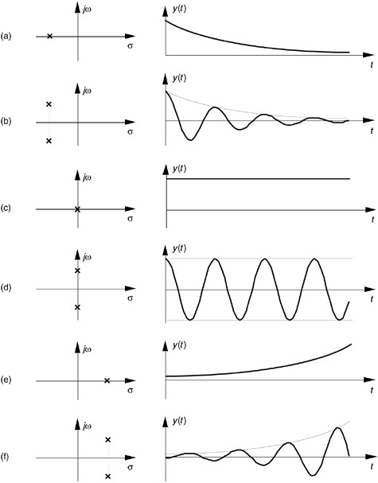

## Systeemtypes
### Dode tijd
Dode tijd is één van de hoofdoorzaken van onstabiliteit in de procesindustrie. Het is de belichaming van het tijdsverschil tussen een initiële actie en het waarnemen van het effect ervan. Systemen met pure dode tijd zullen exact dezelfde initiële actie weergeven slechts na een periode van tijd.
$$ y(t) = x(t - t_0) $$  
$$ Y(s) = \exp^{-t_0s}X(s) $$
Het is interessant om te weten dat een serie van eerste orde systemen een schijnbare dode tijd kan veroorzaken. Wanneer bijvoorbeeld verschillende watervaten na elkaar verbonden worden zal een verandering van het startdebiet pas na een periode van tijd een verhoging van het waterniveau van het laatste vat veroorzaken. Veelvoorkomende processen met dode tijd: transportbanden, warmtewisselaars, logistiek, pijplijnen, etc. 

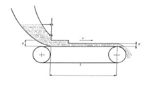

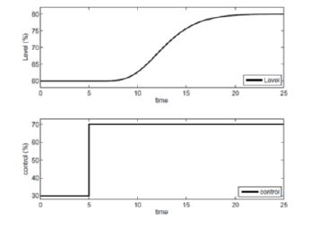

### Eerste orde
Een populaire manier om een proces weer te geven is een eerste orde model. Een eerste orde differentiaalvergelijking vormt na het gebruiken van een Laplacetransformatie de transferfunctie van het proces. 
$$ \tau \frac{dy(t)}{dt} + y(t) = k u(t) $$
$$ \tau s Y(s) + Y(s) = k U(s) $$
$$ (\tau s + 1) Y(s) = k U(s) $$
$$ H(s) = \frac{Y(s)}{U(s)} = k \frac{1}{\tau s + 1} $$

In de teller bevinden zich geen 'nullen'. De pool ($s_1$), de wortel van de noemer, is te vinden door de noemer gelijk te stellen aan nul.  
$$ \tau s + 1 = 0, s_1 = \frac{-1}{\tau} $$ 
Het vinden van de polen en nullen is van groot belang in het nagaan van het procesgedrag. De pool (of polen) 
Het effect van $\tau$ is te zien op figuur \ref{fig:veranderlijketijdsconstanten} waarin grote tijdsconstanten een trage reactie van het systeem representeren. 

### Veranderlijke tijdsconstanten
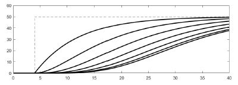
### Eerste orde stap reactie
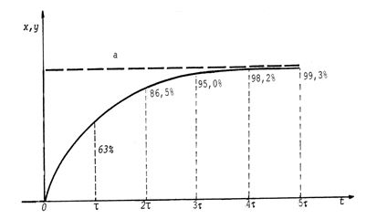
### Eerste orde impuls reactie
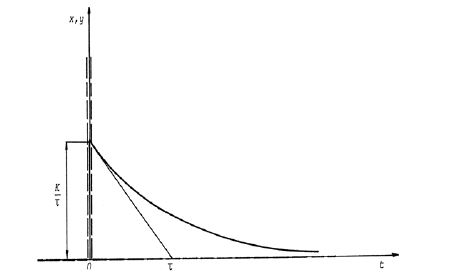
### Eerste orde talude reactie
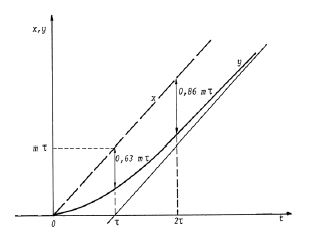

### Tweede orde
Een tweede orde model volgt dezelfde procedure als een eerste orde model maar baseert zich op een tweede orde differentiaalvergelijking. Door deze extra parameter kan het model de werkelijkheid dichter benaderen en dus meer nauwkeurige resultaten produceren. De combinatie met dode tijd komt veel voor. 
$$ \frac{K}{(\tau_1s + 1)(\tau_2 + 1)} \exp^{-t_0s} $$

### Hogere orde
In het hoofdstuk 'Identificatie' staat beschreven hoe het capteren van data het bouwen van nauwkeurige wiskundige modellen mogelijk maakt. In deze stap is een model van hogere orde wenselijk om simulaties zo realistisch mogelijk te maken. Wat volgt is een n-de graadsveeltermvergelijking.

$$ H(s) = \frac{b_N s^N + b_{N-1} s^{N-1} + ... b_0}{a_M s^M + a_{M-1} s^{M-1} + ... a_0} $$

De vergelijking heeft n wortels die complex toegevoegd kunnen worden om de volgende vergelijking te vormen.

$$ H(s) = K \frac{(s-z_1)(s-z_2)...(s-z_n)}{(s-p_1)(s-p_2)...(s-p_m)} $$
De versterking ($K$), de nulpunten ($z_i$) en de polen ($p_i$) zijn duidelijk te herkennen. Ieder systeem valt dus te beschrijven als een serie van eerste en/of tweede orde systemen.

### Voorbeeld:

Stel het systeem $H(s) = (\frac{0.25}{s^2 + 0.9s + 0.25})^5 \frac{1}{10s + 1}$
Dit systeem kan eenvoudig benaderd worden door $H'(s) = \frac{1}{11.6s + 1} \exp^{-17.5s}$

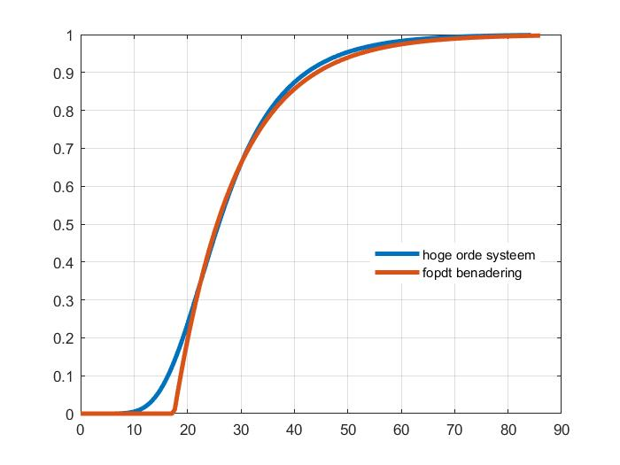

Het hoofdstuk 'Identificatie' beschrijft het creëren en selecteren van de juiste modellen om processen te representeren.

Om aan te tonen dat een hoge orde systeem een serie van eerste en/of tweede orde systemen is, geven we het volgende voorbeeld.
$$ H(s) = \frac{8}{(s+1)(s^2 + 2s + 3)} $$
In partieelbreuken zien we een eerste orde en een tweede orde model.
$$ H(s) = \frac{4}{s+1} + \frac{-4s-4}{s^2+2s+3} $$
Elk stap antwoord ziet er als volgt uit.

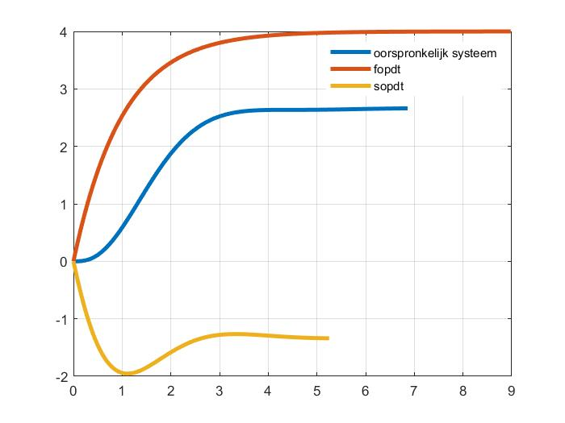

\begin{comment}
### Vertraging (lag)

### Aanlooptijd (lead)
\end{comment}

## Frequentie analyse
Door het systeem via een open lus perspectief te bekijken is het mogelijk om een frequentie analyse uit te voeren. De transferfunctie GH is hier van belang want dit stelt het proces (G) en de feedback (H) in serie voor. 

### Bode
Een Bode plot geen twee grafieken weer. Versterking en fase in functie van hun frequentie. 

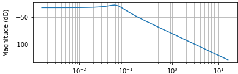

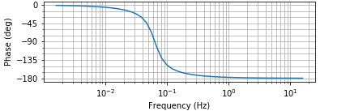

Deze weergave is handig om stabiliteit criteria zoals versterkings- en fase marges te berekenen. Deze onderwerpen krijgen meer aandacht in het hoofdstuk 'stabiliteit'. 

### Nichols curve
Nichols curve is een combinatie van de versterkings- en fase curve. Hierop valt direct af te lezen over welke stabiliteit het gaat. 

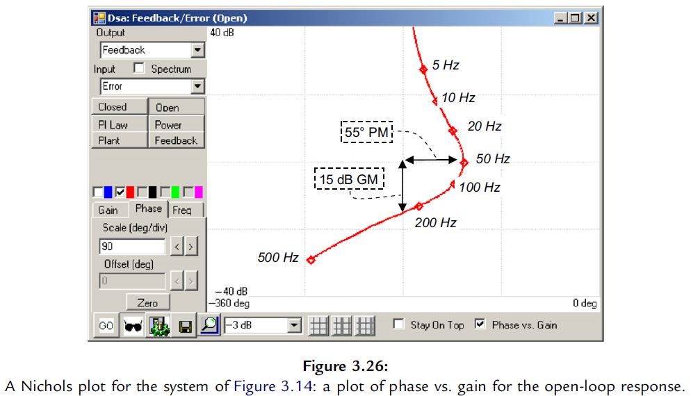
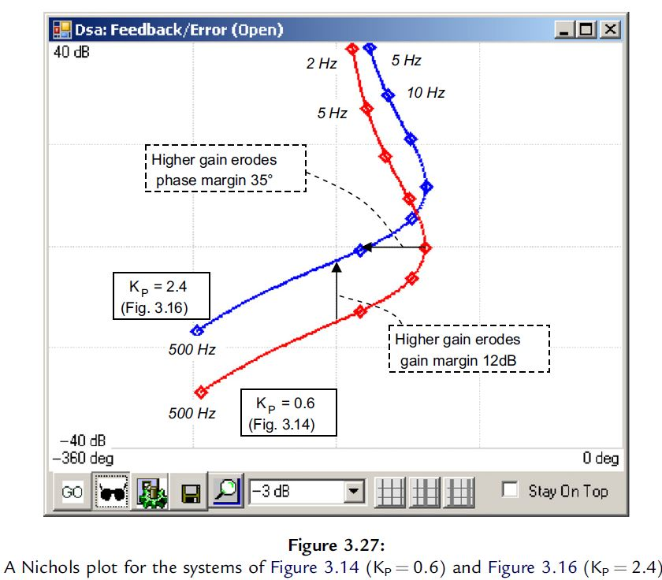

\todo{maak duidelijk adhv grafieken wat er gebeurd als de parameters veranderen}

### Nyquist
Een Nyquist plot geeft de amplitude en de fase van een transferfunctie op een grafische manier weer in een reëel-imaginair veld.

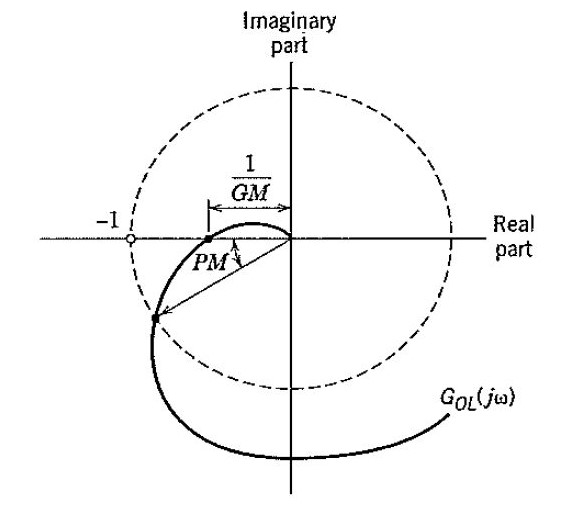

## Identificatie
### Overzicht
Systeemidentificatie is het bouwen van een wiskundig model uit data dat een dynamisch systeem representeert. De nauwkeurigheid van het model t.o.v. de werkelijkheid bekomt men door het model te testen op data die niet werd gebruikt om het model op te bouwen. Dit wordt validatie data genoemd. Het juiste model kiezen om een proces te representeren vraagt kennis en kunde. Door een begrip te hebben van verschillende modeltypes kan de controle ingenieur gemakkelijke de juiste keuzes maken. 

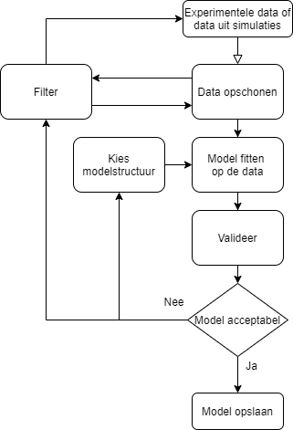

De opmaak van een systeem identificatie probleem bestaat uit vier verschillende onderdelen.

* De dataset.
* De model structuur.
* De criteria waarmee de fit tussen data en modellen bestudeerd worden. 
* De validatie (en acceptatie) van de resulterende modellen.

De dataset moet voldoende informatie bevatten om een kwalitatief model te verkrijgen. Het proces in het achterhalen van een geschikte dataset staat bekend als de 'experimentele ontwerp' fase. 

### Algemene parameters schatten
De kleinste kwadraten methode (least squares) en de maximale waarschijnlijkheidsmethode (maximum likelihood) zijn statistische standaard technieken om modelparameters te berekenen. 

* Modellen aanpassen met data
* Modelkwaliteit
* Indicaties voor modelfit
We beschrijven drie verschillende waarden ($\lambda$, $\theta * $ en de variantie error) die een indicatie geven van de modelfit. 
$\lambda$ is de onvermijdbare afwijking want het exact voorspellen van het uitgangssignaal is niet mogelijk. 
$W(\theta * )$ is de errorwaarde voor de partijdigheid (bias) van het model. Deze is afhankelijk van de gekozen modelstructuur en de omgeving van het experiment. We denken hierbij aan de ingangsspectra, mogelijke feedback,... 
De variantie error is niet afhankelijk van de modelstructuur of van de omgeving maar wel van het aantal modelparameters en het aantal datapunten. Het verschil tussen geschatte en werkelijke variantie zal groter worden als het model meer parameters bevat, en zal kleiner worden als er meer datapunten beschikbaar zijn.
* Modelstructuur kiezen
Kruisvalidatie is een populaire aanpak in het beoordelen van modelstructuren.
* Algoritmes
Online (recursief), offline (batch), de hellingshoek, locale minima,... 

### First Principal

### Data gedreven
* Lineair black box systeem

### Hybride
Hierin combineren we de first principals methode met data gedreven technieken om aan parameter estimatie te doen.

* Fysische geparametriseerde modellen
* Niet lineaire black box systemen

### Eigensystem realization algorithm (ERA)
### Balance truncation (BT)
### BPOD
### Dynamical mode decomposition (DMD)

\begin{comment}

## Stabiliteit

Als het systeem in open lus een unitaire versterking en 180° verschilt in fase bij 0Hz dan is het systeem niet stabiel. Want deze situatie zal oscillaties ondersteunen.

Uit ervaring leken de marges 10-25 [dB] voor de versterking en 35-80 [°] voor de fase een goede start te zijn. De marges zijn afhankelijk van de toepassing en het soort controller. 

* todo: bode/fase plot voor GM en PM

### Oefening

Een open-lus bode plot geeft de versterkings- en fasemarge weer. Een gesloten-lus bode plot geeft de bandbreedte, pieken, overshoot, rise time, ... weer. 

Pieken mogen onder normale omstandigheden de waarde van 1 à 2 dB niet overschrijden. 

### Root locus

\end{comment}